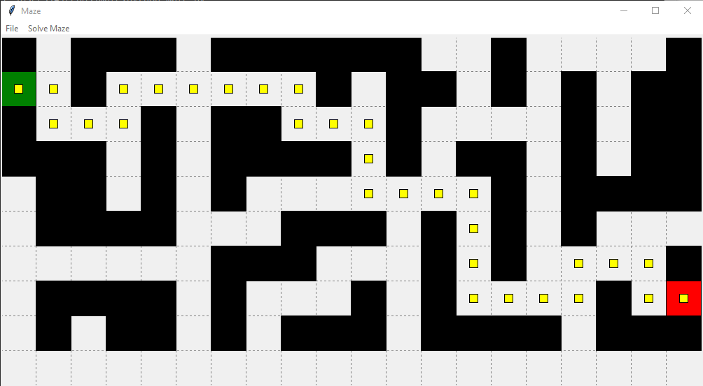

# maze

Application to draw and solve mazes, exploring graph search algorithms. Clicking on the grid squares you can
edit a maze. Then solve it using breath first or depth first searches and compare the results. Each search
algorithm will mark its path with yellow "breadcrumbs."

To run, after downloading the exectuables or cloning this repository, just run

>>python maze.py

Warning: with excessively sparse a maze, depth first will possibly get lost. In that case, it will time out.
